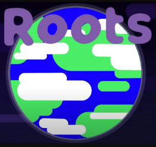
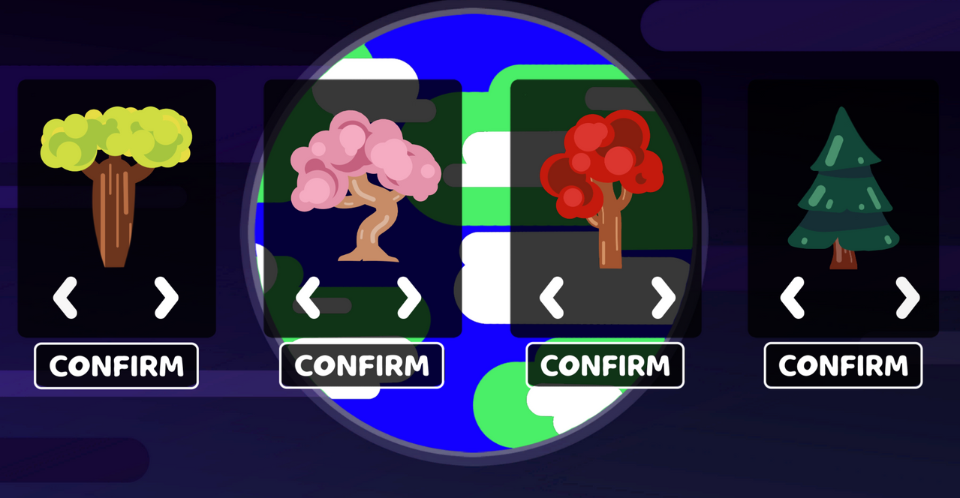
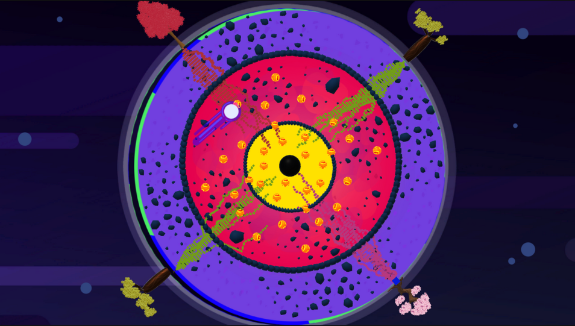

# Roots
Global Game Jam 2023

The jam's theme was : Root.
Local multiplayer - 1 VS 1 (up to 4 players)

A Root© production :

- Francisco De Carvalho Pereira (Dev)

- Charly Despeyroux (Sound / UI / Dev)

- Emma Cieutat (2D / UI)

- Hortense Daunan (3D / VFX / Animation)

Special thanks to Benjamin Bouteille

My missions : Gameplay Programmer - Game Designer

Choose your tree and do all your best to reach the center of the earth first. Will you be the fastest ?

My missions during this jam were to program the gameplay mechanics of the game. I also participated in the elaboration of the game design.

